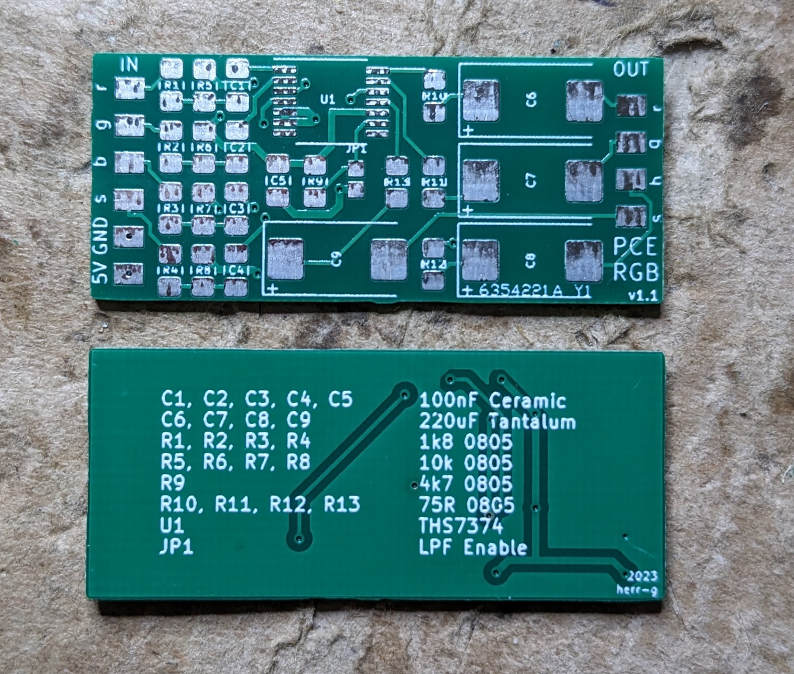
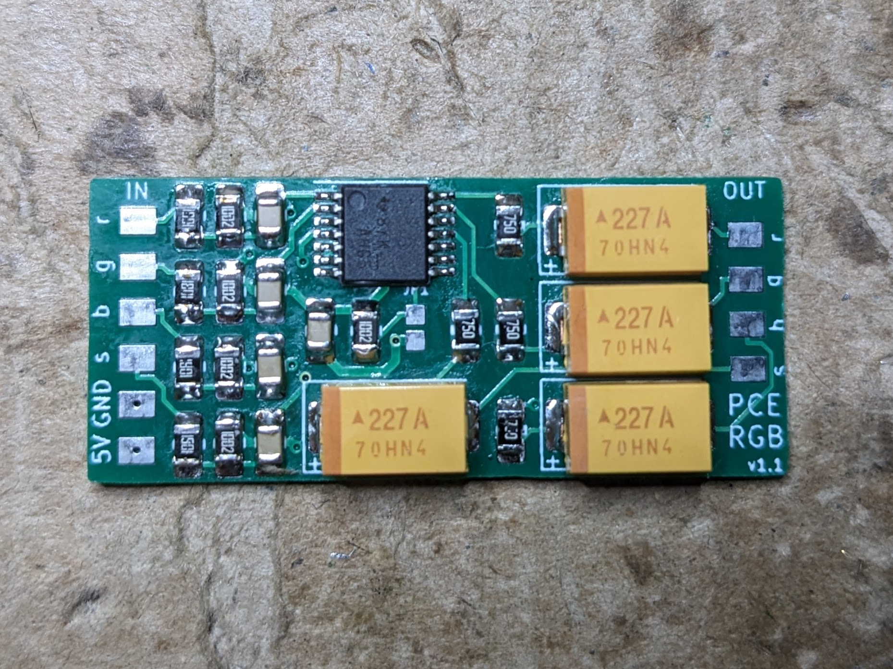
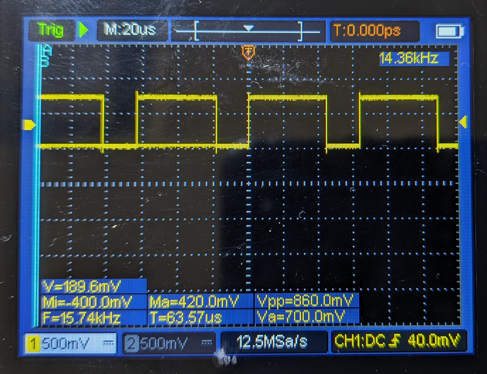
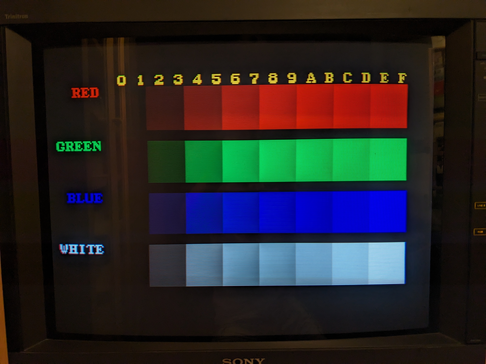
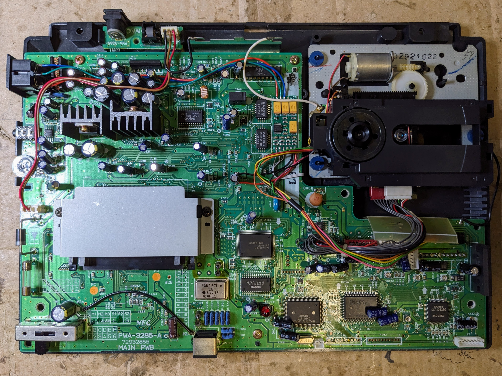
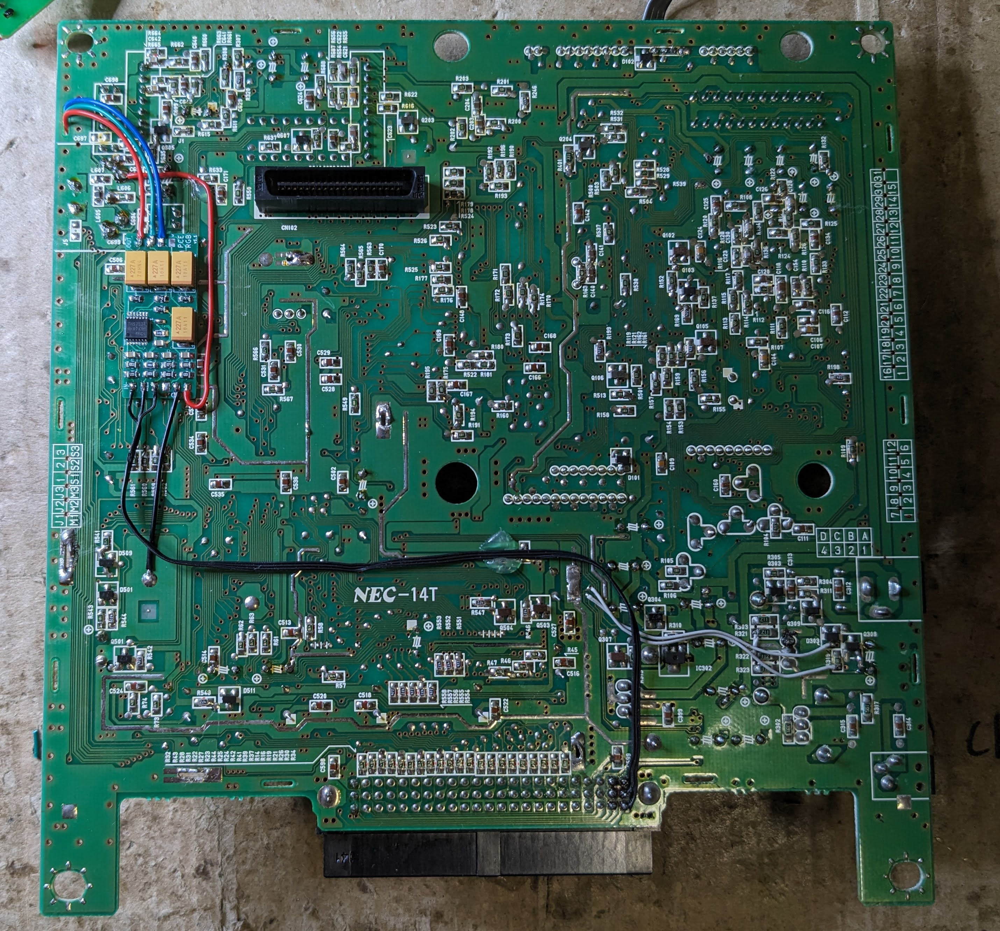

# PC Engine THS7374 Universal RGB Amp

From time to time I do console repairs and mods for fellow people. Since PC Engine repairs were often requested with a RGB amp setup and I couldn't find any modern publicly available gerbers I decided to sketch one by myself for public use.
This 4-channel RGBS Amp is based on Voultars schematic:
- THS7374 quad-amp
- Input pullups via 1.8k/10k voltage dividers
- 75R and 220uF caps inline on the outputs
- LPF optional via solder bridge on JP1
- Minimum footprint at 35,5mm * 15,4mm

I found 0,8mm PCB thickness to be just perfect.
Note for JLCPCB: Set the option 'Remove Order Number' to 'Specify a location' and the order number will be hidden under the bottom right tantalum cap.

The output voltage was measured at exactly 0,7Vpp (75R termination)

Test pattern using 240p Test Suite

Example for a finished setup in a PCE Duo

Example for a finished setup in a Super CD-ROM

